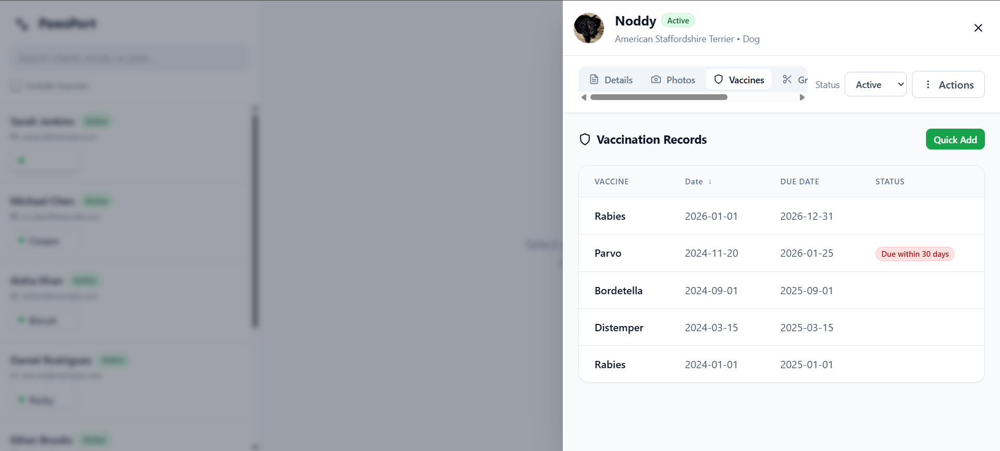

# PawsPort - Pet Profile Drawer

PawsPort is a React + TypeScript dashboard that lets you browse clients and open a **profile drawer** for each pet to view and edit key details, as well as browse related records like vaccinations, grooming, and bookings.

This repository was built to match the "Pet Profile Drawer" assignment requirements.

## Screenshots

Add your 3 screenshots to `docs/screenshots/` using these filenames:

- `docs/screenshots/01-clients-list.png`
- `docs/screenshots/02-pet-drawer-details.png`
- `docs/screenshots/03-vaccinations.png`

Then they'll render here automatically:

| Clients list | Drawer (Details) | Vaccinations |
| --- | --- | --- |
|  |  |  |

## Key Features

- **Client & pet browsing**
  - Search by client name/email and pet name
  - Debounced filtering (`useDebounce`, 400ms)
  - Optional "Include Inactive" filter
- **Pet Profile Drawer**
  - Drawer UX with accessible tabs (Details, Photos, Vaccines, Grooming, Bookings)
  - Status control (Active/Inactive)
- **Deactivate Pet flow (implemented additionally by me)**
  - From the drawer, change **Status** from **Active -> Inactive** to deactivate a pet
  - Updates persist via the mock API and immediately reflect in the left list when "Include Inactive" is toggled
- **Edit + validation**
  - Edit pet details and save
  - Validation rules
    - DOB must not be in the future
    - Weight must be 0-200 and max 2 decimals
- **Vaccinations workflow**
  - Quick Add inline form
  - Automatically computes "Due Date" as **administered date + 1 year**
  - "Due within 30 days" badge
- **Optimistic updates**
  - Pet update uses React Query optimistic update + rollback
  - Simulated API failure rate (disabled under Cypress)

## Tech Stack

- **React 18** + **TypeScript**
- **Vite** (dev server/build)
- **Tailwind CSS** (utility-first styling)
- **TanStack Query** (server state + caching + optimistic updates)
- **json-server** (mock REST API)
- **Testing**
  - **Jest** + **React Testing Library** (unit + component tests)
  - **Cypress** (E2E)

## Project Structure (high level)

- `App.tsx` - Main page (search + list + drawer + toast overlay)
- `src/api/client.ts` - API wrapper (`fetch`) + simulated delay/failure
- `src/features/clients/ClientsList.tsx` - Client list UI and pet buttons
- `src/features/pets/PetDrawer.tsx` - Drawer container, tabs, edit/save
- `src/features/pets/tabs/*` - Details/Photos/Vaccinations/Grooming/Bookings
- `src/utils/*` - Form validation and date helpers

## Getting Started

### 1) Install

```bash
npm install
```

### 2) Run app + API

```bash
npm start
```

- App: `http://localhost:3000`
- API: `http://localhost:4000`

## Scripts

- `npm run dev` - Vite dev server
- `npm run api` - json-server on port `4000`
- `npm start` - run app + API concurrently
- `npm test` - Jest unit/component tests
- `npm run test:watch` - Jest watch mode
- `npm run cypress` - Cypress UI runner
- `npm run cypress:run` - Cypress headless runner

## Testing

### Unit + Component (Jest/RTL)

```bash
npm test
```

### End-to-End (Cypress)

1) Start the app in one terminal:

```bash
npm start
```

2) Run Cypress in another terminal:

```bash
npm run cypress
```

Or headless:

```bash
npm run cypress:run
```

## Notes / Known Behavior

- `src/api/client.ts` simulates latency and occasional update failures to demonstrate optimistic UI.
- Under Cypress, simulated failures are disabled to keep E2E stable.
- Deactivating a pet is supported via the **Status** control in the drawer (Active/Inactive).
